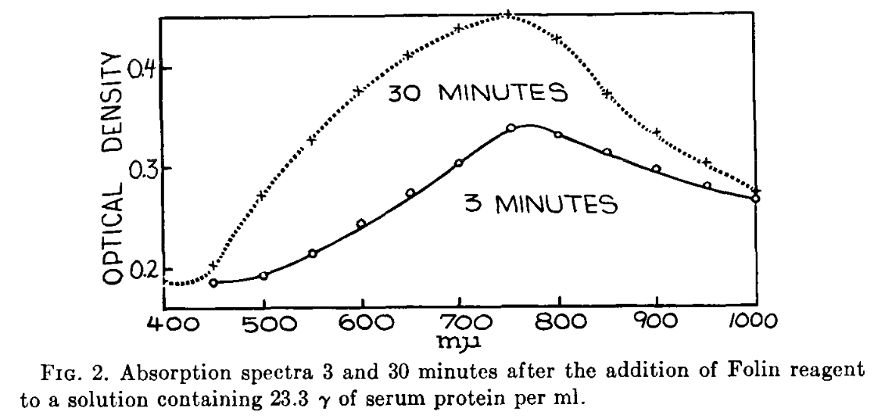

# Custom Widgets in PyQt5

In a sense, we've made a custom widget any time we've inherited from 
any class that "is a" QtWidget.  Here, we'll see how quite a bit of 
nice functionality can be tucked into one widget.  We'll also explore 
how QPainter can be used to produce unique looks for otherwise 
common widgets.

Show me the Yellow.

## Exercise 1 

Open the `paint.py` application.  

  1. (Yellow). Run it as is.  What does it do?  (Blue when ready.)
  2. (Yellow).Comment line 29 (`painter.drawPoint...`) and uncomment line 30 (`painter.drawLine...`).  Run it again. (Blue when ready.)
  3. (Yellow).Modify the line width and color and run it again.(Blue when ready.)

Use the cards like this for all tasks below.

## Exercise 2

  4. Copy your Mordor `main.py` (from `basic_bitmaps`) into this folder (`custom_widgets`).  
     Show me your path to Mordor.  

  5. Modify your `main.py` to use your new `Canvas` class defined in `paint.py`.  Your result 
     should be a Mordor map on which you can draw your path to Mordor.  
     (You *may* wish to adapt `Canvas` to accept an image file as an alternative
     to the default white background.  You choose how to do this.  I'll give an example.)

## Exercise 3

  6. Copy your `run_plotter.py` (from `embedded_graphs`) into this folder.  
     Replace the graph widget with your `Canvas` widget and load the 
     `data.png` image shown here:

     
     
     
     This image is taken from 

        Lowry, Oliver H., et al. "Protein measurement with the Folin phenol 
        reagent." Journal of biological chemistry 193 (1951): 265-275.

    As of 11/12/2021, this is the mostly highly cited article of all 
    time with [over 300,000 citations](https://www.nature.com/news/the-top-100-papers-1.16224).

  7. Use your canvas with an appropriate pen color and width to draw
     on top of and simultaneously extract the points of the graph 
     shown in the image.  Ultimately, you want these points to go in your
     your spreadsheet.  

  8. The values you extract are *pixel* positions relative to the 
     `Canvas` object.  How would you convert those values to the 
     numerical values shown in the image?

     (Hint: you might check out [this website](https://automeris.io/WebPlotDigitizer/) 
      for a hands on example of what we are trying to do!)

     
## For Further Study

To see an example of a `QPainter`-enhanced widget, checkout out MF Chapter 30 and
the "PowerBar meter" example.  Like our current application, this widget is really 
a combination of existing widgets and a custom "paint job" but the purpose is
more display and less interaction.

Also, checkout out MF page 475 and the concept 
of [skeuomorphism](https://en.wikipedia.org/wiki/Skeuomorph).

  

